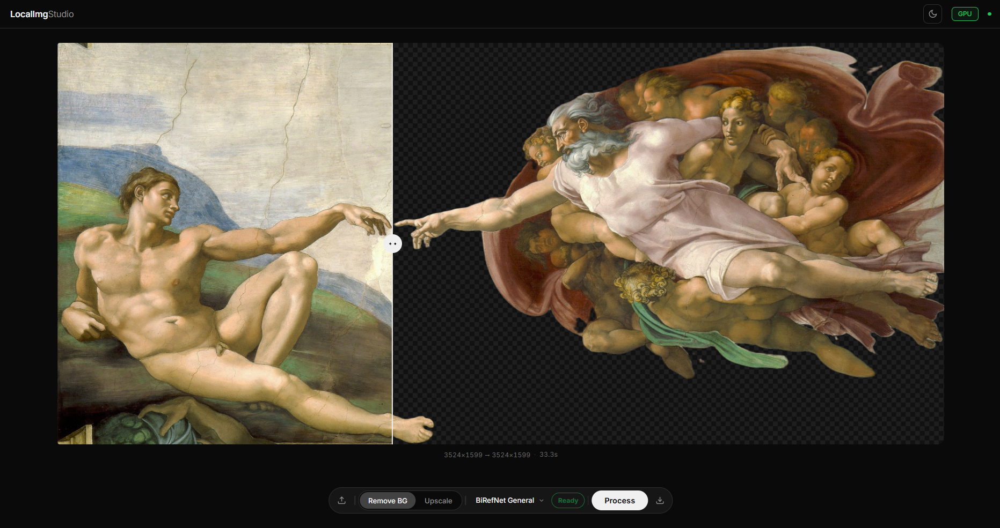

# localimgstudio

Local image processing pipeline: background removal + upscaling. 


**Upscaling**: Real-ESRGAN (via spandrel)
**BG removal**: BiRefNet, BEN2, ISNet, U2Net (rembg)

## Setup

### Downloading models

rembg handles downloading bg removal models automatically (~200–700 MB, cached in `~/.u2net/`).  

Experimental support for downloading upscaling models. Try downloading from UI first.

Place the `.pth` files in `models/`:

| File | Download |
|---|---|
| `RealESRGAN_x4plus.pth` | https://github.com/xinntao/Real-ESRGAN/releases/download/v0.1.0/RealESRGAN_x4plus.pth |
| `RealESRGAN_x2plus.pth` | https://github.com/xinntao/Real-ESRGAN/releases/download/v0.2.1/RealESRGAN_x2plus.pth |
| `RealESRGAN_x4plus_anime_6B.pth` | https://github.com/xinntao/Real-ESRGAN/releases/download/v0.2.2.4/RealESRGAN_x4plus_anime_6B.pth |


### Run

```bash
uvicorn main:app --reload --port 8000
```

Open http://localhost:8000 in your browser.


## Models

### Background Removal (via rembg, auto-downloaded)

| Key | Description |
|---|---|
| `birefnet-general` | Best all-rounder (default) |
| `birefnet-portrait` | Optimized for portraits |
| `ben` | BEN — good hair/edge detail |
| `isnet-general-use` | ISNet general |
| `u2net` | Legacy U2Net |

### Upscaling (manual download required)

| Key | Scale | Best for |
|---|---|---|
| `realesrgan-x4` | 4x | Photos (default) |
| `realesrgan-x2` | 2x | Photos |
| `realesrgan-x4-anime` | 4x | Anime / illustrations |
